# Group 1 / Group 3：Profile 首次发布机制专项只读审查

审查日期：2026-07-27。审查对象为工作区中既有未提交的 Group 1 / Group 3 相关改动；本报告不构成对这些改动的提交批准。

## 1. 执行摘要

【已核实事实】Schema 将 `Profile.isPublic` 默认值从 `true` 改为 `false`，新增可空 `firstPublishedAt`；注册和多数草稿保存路径默认创建私有 Profile。迁移只修改数据库默认值并新增可空列，未批量更新历史记录。

【风险判断】当前实现不能进入正式基线。普通资料保存 API 可以直接接收 `{ "isPublic": true }` 并完成公开，正式“发布”没有独立、不可绕过的服务端命令边界；私有或受限主页的 Metadata/Open Graph 仍使用 Profile 的名称、简介和头像；公开产品 API 的可见性校验也弱于公开页面。

最终结论：**REJECT_AND_REDESIGN**。

## 2. 产品规则符合度

| 规则 | 结论 | 证据与说明 |
|---|---|---|
| 新用户拥有草稿主页，默认不公开 | 符合 | 注册事务创建 Profile，`isPublic: false`；Schema/迁移默认值也为 false。 |
| 保存不等于发布 | 部分符合 | `/api/dashboard` 的草稿保存不会公开；但 `/api/dashboard/profile` 同时是设置保存和发布写入口，任意已认证用户可提交 `isPublic: true`。 |
| 预览不等于公开 | 部分符合 | Onboarding 与 Console 使用本地 `PhonePreview`；公开页正文在服务端检查 `isPublic` 后才渲染。Metadata 例外见 P0。 |
| 只有明确发布操作可公开 | 不符合（P0） | `PATCH`/`PUT /api/dashboard/profile` 没有 publish-only action；普通设置 payload 可直接公开。 |
| `firstPublishedAt` 只首次设置 | 不符合（P1） | 单请求的既有非空时间戳会被保留，但“读空值后写当前时间”的逻辑不是数据库条件更新；并发首发可覆盖时间。 |
| 下线保留首次发布时间和经营历史 | 部分符合 | 所有已核实下线路径仅写 `isPublic: false`，不写 `firstPublishedAt`、访问或 Lead；但没有行为级测试。 |
| 历史用户安全迁移 | 部分符合（P1） | 已公开/未公开值不会被迁移改写，且未伪造时间；但历史公开用户将持续 `firstPublishedAt = null`，没有明确定义兼容语义。 |
| 服务端是公开访问的最终依据 | 不符合（P0） | 正文有服务端检查；Metadata 和部分公开 API 仍可泄露或绕过完整限制规则。 |

## 3. Schema 评审

【已核实事实】`prisma/schema.prisma:127-128` 定义：

```prisma
isPublic         Boolean   @default(false) @map("is_public")
firstPublishedAt DateTime? @map("first_published_at") @db.Timestamptz(6)
```

【已核实事实】`firstPublishedAt` 是 nullable，适合表示“从未成功发布”；生成的 `src/generated/prisma/schema.prisma` 与该定义一致，`index.d.ts` 也有对应字段类型。`npx prisma validate` 成功。

【风险判断】Schema 本身不能强制“仅在首次发布时写入”或阻止任意应用代码写 `isPublic`；该不变量必须由单一服务端发布命令和条件更新保证。数据库级限制不是本次已实现证据。

## 4. 迁移 SQL 评审

```sql
ALTER TABLE "profiles" ALTER COLUMN "is_public" SET DEFAULT false;
ALTER TABLE "profiles" ADD COLUMN "first_published_at" TIMESTAMPTZ(6);
```

【已核实事实】迁移只变更未来插入的默认值，并增加可空列；没有 `UPDATE`、没有把迁移执行时刻写入历史行、没有把未公开用户意外公开，也不会把既有公开用户改为私有。

【代码推断】PostgreSQL 对默认值变更和增加可空无默认列通常不需要逐行回填；仍会取得 DDL 锁，生产执行窗口和锁时长未验证。

【风险判断】P1：历史公开 Profile 的 `firstPublishedAt` 将为 null。该选择避免伪造时间，但必须明确产品语义（例如“首次发布时间未知的历史用户显示为空/历史迁移标记”，而不是显示迁移时间），并在代码和测试中落实。

## 5. 历史数据影响矩阵

| 数据状态 | 迁移后 `isPublic` | 迁移后 `firstPublishedAt` | 结论 |
|---|---:|---|---|
| 已公开且有真实访问记录 | 保持 true | null | 不会被下线；首次发布时间未知，不能伪造。 |
| 已公开但无访问记录 | 保持 true | null | 同上。 |
| 未公开 Profile | 保持 false | null | 不会被误公开。 |
| 新注册 Profile | 默认 false | null | 满足草稿语义。 |
| 缺少 Profile 的用户 | 无影响 | 无影响 | 现有注册事务会创建 Profile；其他旧用户路径需独立容错。 |

【未验证】没有连接任何数据库，因此未验证真实表大小、DDL 锁、生产历史值分布、迁移回滚或备份恢复。

## 6. 注册、登录与 Onboarding 流程

```mermaid
flowchart TD
  R[POST 注册] --> T[事务创建 User + 私有 Profile]
  T --> V[返回 /onboarding]
  V --> O[Onboarding: 身份资料]
  O --> A[保存第一个客户动作]
  A --> P[本地预览 + 明确发布按钮]
  P --> D[PATCH /api/dashboard/profile {isPublic:true}]
  D --> C[公开页]
  L[登录] --> S{临时用户名或资料不完整?}
  S -->|是| V
  S -->|否，即使未公开| K[/console]
```

【已核实事实】注册使用 `$transaction` 一起创建 User/Profile，Profile 默认私有，并固定返回 `/onboarding`。Onboarding 身份和客户动作保存会调用真实 Dashboard API；发布按钮调用 `PATCH /api/dashboard/profile`。登录目的地由服务端读取的 username/displayName/bio/isPublic 决定。

【风险判断】P1：`resolveAuthenticatedDestination` 将“用户名非临时、名称和简介完整但仍私有”的用户导向 `/console`，而不是继续 Onboarding 的发布步骤。用户仍能在 Console 发布，但这不满足“Onboarding 帮助完成预览并明确点击发布”的严格闭环。

【已核实事实】邮箱验证页成功后固定跳转 `/onboarding`；Onboarding 允许未验证邮箱编辑草稿。公开页会尝试同步未验证邮箱限制，但其他公开 API 的一致性不足。

## 7. 所有已核实的发布状态写入路径

| 路径/函数 | 方法 | 身份与所有权 | 输入 | 可直接写 `isPublic` | 可写 `firstPublishedAt` | 事务/幂等性 | 绕过风险/测试 |
|---|---|---|---|---|---|---|---|
| `src/app/api/auth/register/route.ts` | POST | 注册请求；新 User | 注册资料 | 否，固定 false | 否 | User/Profile 批事务；重复邮箱检查 | 无公开绕过；无真实 DB 测试。 |
| `src/app/api/dashboard/route.ts` | PUT | `requireActiveUser`；按 `user.id` upsert | 草稿资料/用户名 | 否，创建固定 false | 否 | 单次 upsert；无发布语义 | 草稿保存路径基本符合。 |
| `src/app/api/dashboard/profile/route.ts` | PUT 与 PATCH（别名） | `requireActiveUser`；`where: { userId: user.id }` | 含 `isPublic` 的普通设置 | **是** | 是，服务端 `new Date()` | 事务内读后写；无条件原子首发；重试/并发不安全 | **P0：可绕过正式发布命令。** |
| `src/app/api/jeepwork/profiles/[username]/route.ts` | PATCH | `requireJeepworkAdmin` | `hide-profile` / `restore-profile` | 是 | 否 | 可见性与审计日志同一事务 | 恢复公开不写首次时间；需明确管理员恢复是否允许和历史 null 策略。 |
| `src/lib/auth.ts:deactivateUserAccount` | 内部函数 | 账户注销流程 | 无外部公开输入 | 仅 false | 否 | 事务 | 保留首次时间；不删除访问/Lead 的代码未见。 |
| `src/lib/username-registry.ts` | 内部函数 | 由调用方传入用户 | 用户名 | 否，创建固定 false | 否 | 事务 | 不误把合法用户名当临时名的正则已覆盖部分单元测试。 |

【已核实事实】还搜索了 `prisma`、`src`、`tests` 中 `firstPublishedAt`、`isPublic`、`publish`、`unpublish`、`onboarding`、`redirectTo` 与临时用户名调用；未发现其他普通用户把 `firstPublishedAt` 设为非空的实现。

## 8. 保存与发布是否真正分离

结论：**否（P0）**。

`PublicationPanel`、`OnboardingWizard` 和普通外观/系统设置都经由同一个 `saveProfileSettingsRequest` / `/api/dashboard/profile` 通道传递 `isPublic`。虽然 UI 有“确认并发布”按钮，HTTP API 没有要求 action、没有独立发布路由、也没有拒绝“普通保存 payload 带 `isPublic: true`”的规则。因此前端意图不是服务端安全边界。

## 9. `firstPublishedAt` 状态机

```mermaid
stateDiagram-v2
  [*] --> Draft: isPublic=false, firstPublishedAt=null
  Draft --> Published: explicit successful publish\nset timestamp once
  Published --> Published: save / repeat publish\npreserve timestamp
  Published --> Offline: unpublish\nisPublic=false; preserve timestamp
  Offline --> Published: republish\npreserve timestamp
```



【风险判断】当前代码只部分接近该状态机：它会在已读到非空值时删除本次的 `firstPublishedAt` 写入，但两个并发请求可同时读到 null，再分别写入不同时间，后提交者覆盖前者。网络超时后的重试也没有以数据库条件保证稳定结果。P1。

## 10. 公开页与隐私风险

| 风险 | 等级 | 证据 |
|---|---|---|
| 私有/受限 Profile 的 Metadata、Open Graph、Twitter Card 泄露名称、简介和头像 | **P0** | `/[username]/page.tsx` 与 Workspace 员工公开页在判断正文可见性之前，用真实 Profile 字段调用 `buildPublicProfileMetadata`；该 helper 仅 `noindex`，不会删去内容。 |
| 普通保存 API 可公开主页 | **P0** | `/api/dashboard/profile` 接收 `isPublic`，`PATCH = PUT`，并在资料/链接校验通过后直接写公开状态。 |
| `/api/[username]/products` 仅检查 `isPublic` 和旧 `frozenReason`，未统一检查当前限制/邮箱验证 | **P0** | 可与公开页面的 `getActiveRestrictions` / `canShowPublicProfile` 产生不同结果，受限主页的产品可能被直接 API 读取。 |
| `sitemap.ts` 只按 `isPublic` 列出，未统一邮箱验证/限制判断 | P1 | 可能索引在公开页正文中会被限制的 Profile。 |
| vCard API 不执行邮箱限制同步 | P1 | 它查询既有限制，但不像页面先同步未验证邮箱限制；行为依赖外部限制记录已存在。 |
| 二维码 | 可接受但待测 | Console 仅在 `isPublic` 时显示分享面板；二维码本身编码 URL，不授权 URL。未做浏览器/缓存测试。 |
| 自定义域名/Workspace 公开页 | P0 | 复用同样的 Metadata 泄露模式；正文有 `isPublic` 与限制检查，但 Metadata 不一致。 |

## 11. 现有测试的证据强度

| 命令 | 结果 | 类型 | 能证明什么 | 不能证明什么 |
|---|---|---|---|---|
| `npx prisma validate` | 退出 0 | Schema 静态校验 | Prisma Schema 可解析 | 迁移执行、生成物新鲜度、生产数据影响。 |
| `npm test -- --runInBand tests/saas-ease-closeout.test.ts` | 1 suite / 21 tests 通过 | 纯函数 + 源码字符串断言 | 跳转规则、关键文本/文件包含关系 | HTTP、数据库事务、并发、真实发布。 |
| `npm test -- --runInBand tests/public-profile-redesign.test.tsx` | 1 / 28 通过 | jsdom 组件 Mock | 渲染与 UI 行为 | 服务端 URL、Metadata、权限与数据库。 |
| `npm test -- --runInBand tests/legacy-routes.test.ts` | 1 / 4 通过 | 路由映射/源码断言 | 旧入口映射 | 认证后实际重定向。 |
| `npm test -- --runInBand tests/console-navigation.test.ts` | 1 / 8 通过 | 组件/源码断言 | Console 导航结构 | 发布安全和隐私。 |

【风险判断】没有发现真实 PostgreSQL 迁移/并发测试、Route Handler API 单元测试、Prisma Mock 覆盖发布状态机，或浏览器端到端测试。当前“首次发布持久化一次”的测试只断言源代码包含事务与删除语句，不能证明并发不变量。

## 12. 必须修复的问题

1. **P0**：将普通设置保存与正式发布/下线分离；普通保存必须拒绝 `isPublic` 与 `firstPublishedAt`。
2. **P0**：公开页面和 Workspace/自定义域名页面必须在生成 Metadata、Open Graph、JSON-LD 前执行同一服务端可见性判定；私有/受限页面只能生成受限 Metadata。
3. **P0**：所有公开 API（至少产品 API）必须使用与公开页相同的 `isPublic + 当前限制 + 邮箱验证` 服务端策略。
4. **P1**：首次发布时间应以条件写入或足够隔离级别的单命令保证“仅 null 时写入”，并测试双击、超时重试和并发首发。
5. **P1**：明确历史公开且时间未知的兼容语义，且不以迁移执行时间回填。

## 13. 可接受的改进项

- P2：在 Console 明确显示“草稿/已下线/首次发布时间未知”的历史状态。
- P2：发布后和下线后增加缓存、URL、二维码扫描、搜索引擎预览的浏览器验收。
- P2：将发布审计事件与用户发布操作关联，便于运营追溯。

## 14. 不应在本批顺便处理的问题

- Workspace 数据归属迁移；本批仍以个人 Profile 为数据底座。
- 产品、Lead、AI、支付、会员或 Jeepwork 的重构。
- 删除历史 `/dashboard` / `/workbench` 兼容入口。
- `sites/link168-test`、生成物追踪策略与未知文件清理。

## 15. 精确建议修改文件列表（后续获批批次）

```text
prisma/schema.prisma
prisma/migrations/202607270001_profile_first_publish/migration.sql
src/app/api/dashboard/profile/route.ts
src/app/api/dashboard/profile/publish/route.ts                 # 新增
src/app/api/dashboard/profile/unpublish/route.ts               # 新增
src/components/dashboard-v1/dashboard-api.ts
src/components/dashboard-v1/core-store.ts
src/components/dashboard-v1/PublicationPanel.tsx
src/components/onboarding/OnboardingWizard.tsx
src/lib/onboarding.ts
src/app/[username]/page.tsx
src/app/%5F_w/[workspaceId]/p/[slug]/page.tsx
src/lib/seo/public-profile.ts
src/app/api/[username]/products/route.ts
src/app/sitemap.ts
src/app/api/public/[username]/vcard/route.ts
src/app/api/jeepwork/profiles/[username]/route.ts
```

生成 Prisma 文件只应在 Schema/迁移获批并重新生成、核对后随同提交；本审查未生成或修改它们。

## 16. 建议新增测试

```text
tests/profile-publication-api.test.ts
tests/profile-publication-concurrency.integration.test.ts
tests/profile-publication-migration.integration.test.ts
tests/public-profile-privacy-metadata.test.ts
tests/public-profile-privacy-api.test.ts
tests/onboarding-publication-flow.e2e.ts
tests/workspace-public-profile-privacy.test.ts
```

覆盖：普通保存含 `isPublic:true` 被拒绝；正式发布必须认证、归属、完整资料和有效动作；首发双击/超时重试/并发仅写一次时间；下线与重新发布保留时间和历史数据；四类历史用户迁移矩阵；私有/受限页面的 HTML、Metadata、OG、JSON-LD、API、sitemap、vCard、二维码；邮箱验证和 Workspace 自定义域名的一致性。

## 17. 最终结论

**REJECT_AND_REDESIGN**。

【已核实事实】默认私有、可空首次发布时间、注册事务、草稿持久化、公开页正文拦截以及下线保留时间的方向均合理。

【代码推断】将发布改为独立服务端命令、以条件更新保证首次时间、并抽取统一公开可见性策略，可以在不进行 Workspace 迁移的前提下满足本批产品规则。

【未验证】未执行真实数据库迁移、并发、浏览器或生产环境测试。

【风险判断】在 P0 修复和相应行为级测试完成前，Group 1 / Group 3 不应纳入正式基线。
