# Profile 发布状态机、服务端发布边界与统一公开可见性策略设计

设计日期：2026-07-27。基于 `08_GROUP1_FIRST_PUBLICATION_REVIEW.md`、当前 `prisma/schema.prisma`、现有 Dashboard/Jeepwork/公开页代码。实际 Workspace 路径为 `src/app/%5F_w`；不存在 `src/lib/restrictions.ts`，限制能力当前在 `src/lib/auth.ts`。

## 1. 执行摘要

选择 **APPROVE_DESIGN_A**：普通资料保存保持 `PUT /api/dashboard/profile`，新增独立的 `POST /api/dashboard/profile/publish` 与 `POST /api/dashboard/profile/unpublish`。发布状态只能由发布领域服务写入；公开页面、Metadata、公开 API、sitemap 和 Workspace 员工页通过同一个 fail-closed 访问解析器取得安全数据。

首发时间使用 PostgreSQL 参数化单语句：`first_published_at = COALESCE(first_published_at, NOW())`，与 `is_public = true` 在同一更新中完成。这样并发和重试均不会覆盖已写入的时间。

## 2. 当前问题

1. `src/app/api/dashboard/profile/route.ts` 同时处理保存、公开和下线，`PATCH = PUT`，普通 payload 可直接写 `isPublic`。
2. 该路由在事务中先读再写 `firstPublishedAt`；并发首次发布可覆盖时间。
3. `/[username]` 与 `src/app/%5F_w/[workspaceId]/p/[slug]` 的 Metadata 在可见性判定前读取并输出名称、简介、头像。
4. 产品 API 和 sitemap 没有与页面使用同一完整限制规则。
5. Jeepwork 的 `restore-profile` 直接将 `isPublic` 写为 true，把平台解禁与用户发布意图混为一体。

## 3. 设计目标

- 新注册 Profile 是私有草稿：`isPublic=false`、`firstPublishedAt=null`。
- 保存、预览、发布、下线是不同服务端动作。
- 首次发布的时间只能写一次，重复请求稳定返回。
- 所有公开入口只输出已获准的最小公开 DTO；拒绝时不加载敏感字段。
- 用户发布意图、平台限制、Workspace 成员状态和域名状态共同决定可见性。
- 不实施 Workspace 数据归属迁移，不重构支付、AI、Lead、会员、Console 或 Jeepwork 整体。

## 4. 非目标

- 不将 Profile、Product、Lead、AI 数据迁移到 Workspace 外键。
- 不以 `createdAt`、访问记录或 Lead 时间伪造历史首次发布时间。
- 不通过数据库 trigger 替代应用层的权限、资料完整性和审计判断。

## 5. 三种发布 API 方案比较

| 方案 | 安全边界 | 兼容与客户端成本 | 测试/职责 | 绕过及误发布风险 |
|---|---|---|---|---|
| A：`POST /publish`、`POST /unpublish`，保存仍为 PUT | 最清晰；保存 DTO 根本不含发布字段 | 现有两个 UI 调用点改为新 URL；旧保存调用不变 | 每条命令单独测；路由职责单一 | 最低；保存无法自然变成发布 |
| B：`POST /publication` + `action` | 边界清晰，但单路由分支较多 | 两个 UI 调用点改为 action payload | 可按 action 测；审计集中 | 低；仍需严格拒绝未知 action |
| C：保存路由增加 `action` | URL 兼容性最高 | 客户端改动最小 | 保存/发布逻辑混在一个 Handler | 最高；遗漏 action 或字段白名单时可回归为绕过 |

**最终推荐：A。** 当前仓库已经有 `PublicationPanel` 和 Onboarding 的明确发布按钮，独立命令与 UI 心智一致；不会把“普通设置保存”重新变为发布入口。

## 6. 最终 API

### 普通保存

`PUT /api/dashboard/profile`

请求 DTO 只允许资料与展示设置字段；若出现 `isPublic`、`firstPublishedAt`、`publicationHistoryStatus` 或任何发布字段，返回 `VALIDATION_FAILED` / HTTP 400。此路由不得调用发布领域服务的状态写方法。

### 发布与下线

```ts
type PublicationCommand = { idempotencyKey: string };

POST /api/dashboard/profile/publish
POST /api/dashboard/profile/unpublish
```

`idempotencyKey` 为 16–128 个可打印 ASCII 字符；客户端为每次用户点击生成 UUID，网络重试复用同一键。响应返回：

```ts
type PublicationResponse = {
  success: true;
  state: "published" | "unpublished";
  firstPublishedAt: string | null;
  idempotentReplay: boolean;
};
```

## 7. 发布状态机

```mermaid
stateDiagram-v2
  [*] --> Draft: 注册/创建\nisPublic=false; firstPublishedAt=null
  Draft --> Published: publish 命令通过\n原子写入首次时间
  Published --> Published: 重复 publish\n时间不变
  Published --> Offline: unpublish 命令\nisPublic=false; 时间保留
  Offline --> Published: publish 命令\n时间保留
  Draft --> Draft: 普通保存或预览\n不改发布字段
```



平台限制、邮箱未验证、成员禁用、域名未验证不是上述用户意图状态；它们在统一可见性解析时阻断访问，不自动清空 `isPublic` 或 `firstPublishedAt`。

## 8. 首次发布时间原子方案

### 方案 1：Prisma 条件更新

先 `updateMany`，条件含 `userId`、`isPublic=false`、`firstPublishedAt=null`；计数为 0 时读取当前状态，再区分已发布、重新发布、限制、缺失或并发变化。

优点：Prisma 类型覆盖较好。缺点：首次发布、重新发布和并发分支至少需要多条语句；在发布与下线竞争时仍需额外条件更新和状态重读。

### 方案 2：PostgreSQL 单语句原子更新

```sql
UPDATE profiles
SET is_public = true,
    first_published_at = COALESCE(first_published_at, NOW())
WHERE id = $1 AND user_id = $2 AND is_public = false
RETURNING id, is_public, first_published_at;
```

优点：在一个数据库写入点保证时间只从 null 变为数据库当前时间；重新发布也保留原值；不会有“事务内先读后写”的覆盖窗口。缺点：Prisma 需要 `$queryRaw`，必须仅使用参数化 tagged template、显式返回类型和 PostgreSQL 集成测试。

**最终推荐：方案 2。** 发布前的认证、资料、邮箱和限制检查在事务前或同一事务内完成；状态写入使用此语句。若未返回行，读取最小状态：已公开时作为幂等成功；不存在或状态刚被下线时返回受控并发结果并允许同一幂等键重试。

```ts
type PublicationWrite = { id: string; isPublic: boolean; firstPublishedAt: Date | null };
async function setPublishedAtomically(tx: Prisma.TransactionClient, profileId: string, userId: string) {
  return tx.$queryRaw<PublicationWrite[]>`
    UPDATE profiles
    SET is_public = true,
        first_published_at = COALESCE(first_published_at, NOW())
    WHERE id = ${profileId}::uuid
      AND user_id = ${userId}::uuid
      AND is_public = false
    RETURNING id, is_public AS "isPublic", first_published_at AS "firstPublishedAt";
  `;
}
```

## 9. 历史 Profile 兼容方案

比较结果：选择 **方案 B：新增显式历史状态标记**，不采用时间推断。

```prisma
enum PublicationHistoryStatus {
  NEVER_PUBLISHED
  FIRST_PUBLISH_KNOWN
  LEGACY_HISTORY_UNKNOWN
}
```

- 新建 Profile：`NEVER_PUBLISHED`。
- 本迁移之前已存在的所有 Profile：`LEGACY_HISTORY_UNKNOWN`，无论当前公开或私有；仅现存 `isPublic` 无法证明“从未公开”。
- 新体系的首次 publish：若为 `NEVER_PUBLISHED`，写时间并改为 `FIRST_PUBLISH_KNOWN`。
- `LEGACY_HISTORY_UNKNOWN` 的首次新体系 publish 也只写一次 `firstPublishedAt`，但状态保持 `LEGACY_HISTORY_UNKNOWN`；UI 显示“历史首次发布时间未记录；本系统首次发布于 …”。
- 不使用 `createdAt`、首次访问或首次 Lead 作为真实首次发布时间。它们可作为运营线索，但不能填入该字段。

该字段增加一次明确 Schema/迁移复杂度，换来区分新用户从未发布与旧用户历史未知，且不会伪造历史。

## 10. 统一公开可见性接口

新增 `src/lib/public-profile-access.ts`，由服务端页面、Route Handler 与 sitemap 共同调用。它复用 `src/lib/auth.ts` 的 `getActiveRestrictions` 与 `canShowPublicProfile`，不新建平行限制系统。

```ts
type PublicProfileAccessReason =
  | "allowed" | "not_found" | "private" | "email_unverified" | "restricted"
  | "workspace_disabled" | "member_disabled" | "domain_unverified";

type PublicSafeProfile = {
  id: string; username: string; displayName: string | null; bio: string | null;
  avatarUrl: string | null; theme: string; template: string; contactVisibility: string;
  links: PublicSafeLink[]; products: PublicSafeProduct[];
};

type PublicProfileAccessResult =
  | { allowed: true; profile: PublicSafeProfile; workspace?: PublicSafeWorkspace }
  | { allowed: false; reason: Exclude<PublicProfileAccessReason, "allowed"> };

async function resolvePublicProfileAccess(input: {
  username?: string; workspaceId?: string; slug?: string; host?: string;
}): Promise<PublicProfileAccessResult>;
```

解析顺序：先用最小 select 查询路由身份、`isPublic`、`userId`、邮箱验证、Workspace 关联、成员状态和 Host/域名证明；任何查询或限制查询失败均拒绝。只有 `allowed` 才第二次加载 `PublicSafeProfile` 的公开字段、链接和产品。这样 Metadata 阶段不会先加载敏感字段。

邮箱规则：发布命令要求 `emailVerified=true`；公开访问也直接检查该字段并 fail-closed，不依赖请求时创建冻结记录。`syncEmailVerificationRestriction` 可继续服务现有后台治理，但不作为公开可见性的唯一证据。

内部日志可记录具体 reason、profileId、workspaceId 和请求关联 ID；对访客只返回统一安全结果，不暴露封禁、成员或域名内部原因。

## 11. Metadata 安全策略

`src/lib/seo/public-profile.ts` 增加无敏感输入的 `buildUnavailablePublicProfileMetadata()`：

```ts
title: "页面暂不可访问 | Link168"
description: "该页面尚未发布或当前不可访问。"
robots: { index: false, follow: false }
```

私有、邮箱未验证、受限、Workspace 禁用、成员禁用、域名未验证和 404 对外使用同一安全表现：无 Profile/Workspace 名称、简介、头像、产品、联系方式、OG/Twitter 图片或 JSON-LD。页面可显示统一受限页或返回 404；公共 API 返回 404，sitemap 排除。

## 12. 页面/API 调用矩阵

| 入口 | 统一策略 | 允许输出 | 拒绝输出 |
|---|---|---|---|
| `/[username]` 正文 | 是 | `PublicSafeProfile`、JSON-LD | 统一受限页/404，无敏感内容 |
| `/[username]` Metadata | 是，先解析后取 DTO | 安全 SEO 字段 | 安全 Metadata，无 OG/Twitter 用户数据 |
| `/api/[username]/products` | 是 | `PublicSafeProduct[]` | 404 |
| vCard | 是 | 公开 DTO 中允许的身份/联系字段 | 404 |
| sitemap | 是，批量 resolver 查询 | 已允许 URL/更新时间 | 不收录 |
| Workspace 员工页正文 | 是，含 workspace/member/host | Workspace 安全 DTO | 统一受限页/404 |
| Workspace 员工页 Metadata | 是，先解析后取 DTO | 安全 SEO 字段 | 安全 Metadata |
| 自定义域名入口 | 是，先校验现有 routing proof 与 verified host | 对应 Workspace 安全 DTO | 404 |
| 其他公开 Profile API（AI、联系、点击、短链） | 是或适配器调用 | 该 API 最小公开结果 | 404/通用 unavailable |

## 13. 发布领域服务

新增 `src/lib/profile-publication.ts`：

```ts
type PublicationErrorCode =
  | "UNAUTHENTICATED" | "PROFILE_NOT_FOUND" | "PROFILE_INCOMPLETE"
  | "INVALID_USERNAME" | "EMAIL_NOT_VERIFIED" | "PROFILE_RESTRICTED"
  | "ALREADY_PUBLISHED" | "ALREADY_UNPUBLISHED" | "IDEMPOTENCY_CONFLICT"
  | "CONCURRENT_STATE_CHANGED" | "VALIDATION_FAILED";

validateProfileForPublication(input): Promise<ValidationResult>;
publishProfile({ userId, idempotencyKey, request }): Promise<PublicationResult>;
unpublishProfile({ userId, idempotencyKey, request }): Promise<PublicationResult>;
getPublicationState(userId): Promise<PublicationState>;
resolveLegacyPublicationState(profile): PublicationHistoryStatus;
```

发布服务验证：身份、`userId` 所有权、邮箱验证、合法非临时用户名、显示名称/简介、至少一个有效客户动作、内容安全、活跃限制。它在一个事务内写命令幂等记录、原子状态更新和审计事件。禁止其他代码直接将 `isPublic=true`、`firstPublishedAt` 或历史状态写入 Profile；普通保存 DTO 不包含这些字段。

防绕过措施：集中服务约定；仓库合同测试扫描允许写入点；代码审查规则；CI 对 `profile.update/upsert/updateMany` 中发布字段做 allowlist。数据库 trigger 不作为本批必需项：它无法表达用户资料完整性、限制和幂等语义，且会增加运维复杂度；应用层+CI 合同测试是首选，数据库权限隔离作为生产环境强化项评估。

## 14. 管理员隐藏与恢复

- 用户 `unpublish` 只改变用户公开意图为 false，保留首次时间和历史经营数据。
- Jeepwork `hide-profile` 改为创建或激活平台可见性限制并写审计事件，**不**改用户发布意图。
- Jeepwork `restore-profile` 只清除由该操作对应的平台限制并写审计事件，**不**把 `isPublic` 设为 true，**不**写 `firstPublishedAt`。
- 解除后是否公开由统一解析器重算：仅当用户意图仍为公开、邮箱已验证、无其他限制、Workspace/成员/域名允许时可见。

## 15. 数据模型建议

1. 在 Profile 增加 `publicationHistoryStatus`（见第 9 节）。
2. 新增 `ProfilePublicationCommand`：`id`、`profileId`、`userId`、`action`、`idempotencyKey`、`requestHash`、`resultState`、`firstPublishedAtSnapshot`、`createdAt`；唯一键为 `(profileId, action, idempotencyKey)`。
3. 复用 FreezeRecord 表达平台/邮箱限制；Workspace 成员禁用和 Domain 验证继续来自现有模型，均不折叠进 `isPublic`。

## 16. 错误模型

| 错误 | HTTP | 对用户文案 | 日志 |
|---|---:|---|---|
| UNAUTHENTICATED | 401 | 请先登录后操作 | 常规请求关联 ID |
| PROFILE_NOT_FOUND | 404 | 未找到可操作的主页 | 内部 profile/user 关联 |
| PROFILE_INCOMPLETE / INVALID_USERNAME / VALIDATION_FAILED | 400 | 补全或修正资料后发布 | 字段类别，不记录内容原文 |
| EMAIL_NOT_VERIFIED / PROFILE_RESTRICTED | 403 | 当前无法发布，请完成账户要求或联系支持 | 具体限制原因仅内部记录 |
| ALREADY_PUBLISHED / ALREADY_UNPUBLISHED | 200 | 状态已是最新 | 返回当前快照 |
| IDEMPOTENCY_CONFLICT | 409 | 此操作键与不同请求冲突，请刷新后重试 | request hash |
| CONCURRENT_STATE_CHANGED | 409 | 主页状态刚发生变化，请刷新后重试 | 并发状态与关联 ID |

相同幂等键、相同 action、相同请求 hash 返回原成功结果；相同键不同 hash 返回 409。

## 17. 幂等与并发

命令事务顺序：验证最小状态 → 查/锁幂等命令 → 原子 publish 或条件 unpublish → 写命令结果 → 写审计事件 → 提交。重复键返回已存结果；不同键的并发 publish 由单语句保证首发时间不变；publish 与 unpublish 的最终可见性遵循数据库提交顺序，冲突命令返回当前状态或 409，不猜测成功。

## 18. 迁移与回滚策略

迁移一：保留现有 `is_public` 与 `first_published_at` 变更，增加历史状态和命令表；对迁移前所有 Profile 写 `LEGACY_HISTORY_UNKNOWN`，不触碰 `is_public`，不回填时间。新 Profile 默认为 `NEVER_PUBLISHED`。

迁移二：部署领域服务与公开访问解析器；先启用拒绝路径的监测日志，再切换公开页面/API。回滚时撤回应用版本并保留新字段/命令表；不得清空首次时间或把历史状态逆向伪造。数据库字段保留可使旧代码继续读取 `isPublic`，但旧公开入口不得在 P0 修复前恢复对外流量。

## 19. 测试矩阵

| 层级 | 必须覆盖 | 环境 |
|---|---|---|
| Route Handler | 保存携带发布字段被拒绝；认证/所有权/资料/邮箱/限制；发布/下线/重发结果 | 可 mock 服务与认证 |
| PostgreSQL 集成 | 双浏览器并发首发、同键重试、不同键并发、超时重试、发布与下线竞争、历史矩阵 | 隔离真实 PostgreSQL，禁止 mock |
| 隐私 | 正文、Metadata、OG、Twitter、JSON-LD、产品、vCard、sitemap、AI/联系 API、Workspace/域名 | Route/渲染集成；真实 resolver |
| 浏览器 E2E | 注册→草稿保存→手机预览→明确发布→访问→下线→不可访问→重发且时间不变 | 浏览器 + 隔离数据库 |

## 20. 精确实施文件清单

```text
prisma/schema.prisma
prisma/migrations/202607270002_profile_publication_state/migration.sql
src/lib/profile-publication.ts                              # 新增
src/lib/public-profile-access.ts                            # 新增
src/app/api/dashboard/profile/route.ts
src/app/api/dashboard/profile/publish/route.ts              # 新增
src/app/api/dashboard/profile/unpublish/route.ts            # 新增
src/components/dashboard-v1/dashboard-api.ts
src/components/dashboard-v1/core-store.ts
src/components/dashboard-v1/PublicationPanel.tsx
src/components/dashboard-v1/AppearancePanel.tsx
src/components/onboarding/OnboardingWizard.tsx
src/app/[username]/page.tsx
src/app/%5F_w/[workspaceId]/p/[slug]/page.tsx
src/lib/seo/public-profile.ts
src/app/api/[username]/products/route.ts
src/app/api/public/[username]/vcard/route.ts
src/app/sitemap.ts
src/app/api/jeepwork/profiles/[username]/route.ts
src/generated/prisma/*                                     # 仅随获批 Schema 重新生成
tests/profile-publication-api.test.ts                       # 新增
tests/profile-publication-postgres.integration.test.ts      # 新增
tests/public-profile-access-privacy.test.ts                 # 新增
tests/profile-publication-flow.e2e.ts                       # 新增
```

## 21. 实施任务拆分

1. Schema、迁移、生成物核对与历史状态迁移。
2. 发布领域服务、幂等命令表、Route Handler 行为测试。
3. Dashboard/Onboarding/Console 客户端迁移，移除保存 DTO 中发布字段。
4. 统一公开访问解析器接入个人页、Workspace 页、公开 API 与 sitemap。
5. Jeepwork 限制语义切换、审计事件和隐私/并发/E2E 验收。

## 22. 回滚策略

每个任务独立提交。应用回滚不回滚或删除首发时间、历史状态或命令日志；公开访问解析器出现故障时保持 fail-closed。数据库迁移采用前向兼容字段和保留旧列语义，避免破坏现存 Profile。

## 23. 风险与待老板决定的问题

设计已按确认产品规则作出决定；没有阻断实施的待决问题。

实施风险：raw SQL 的 PostgreSQL 专属性、历史状态迁移的表锁窗口、以及将未验证但当前公开的旧用户切换为不可公开。上述风险分别以参数化 SQL+集成测试、低峰迁移+锁监控、以及上线前受影响用户清单与通知处理。

## 24. 最终推荐结论

**APPROVE_DESIGN_A**。以独立发布/下线路由、原子首发时间写入、历史未知标记、发布领域服务和统一 fail-closed 公开访问解析器，能消除保存绕过、并发覆盖和 Metadata/API 泄露，同时保持个人 Profile 为当前业务底座，不扩大到 Workspace 数据迁移。
