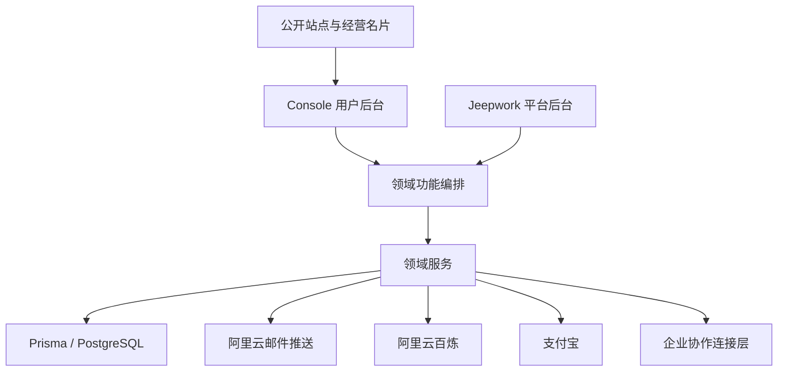

# Link168 V2 架构决策记录

**文件名：** `docs/governance/07_ARCHITECTURE_DECISIONS.md`  
**版本：** v1.1  
**生效日期：** 2026-07-12  
**性质：** 架构治理附件（ADR汇总）  
**上位规则：** `PRODUCT_CONSTITUTION.md` v1.6、`PRD.md` v2.0-rc8、`PROJECT_RULES.md` v1.0-rc3

> 本文件记录已经确定的架构方向和原因，防止后续Agent重复推翻。它不替代产品宪法、PRD、数据库migration或安全运行规则。

---

## 1. ADR使用规则

状态：

- `Accepted`：已采用，开发必须遵守。
- `Proposed`：仅为方案，未获批准不得作为正式规则。
- `Superseded`：已被后续ADR替代，保留历史原因。
- `Deprecated`：不再新增使用，但可能保留兼容。

责任：

- Agent03维护架构事实和ADR文本。
- Agent01组织跨模块影响评审。
- Agent02检查是否改变产品规则。
- Agent07验证安全和回归影响。
- 改变宪法、冻结范围或生产高风险方向仍需老板批准。

修改Accepted ADR必须说明真实问题、影响、迁移、回滚和批准记录，并用新ADR替代，不直接抹去历史原因。

---

## 2. 高层关系图



Console、Jeepwork和Workspace含义不同，见命名标准。

---

# ADR-001：采用模块化单体

**状态：** Accepted  
**责任角色：** Agent01、Agent03

继续采用Next.js模块化单体、PostgreSQL和Prisma，通过领域边界、服务接口、事务和文件锁保持隔离。当前不为技术先进感引入微服务、Kubernetes、Kafka或复杂分布式中间件。

只有真实流量、团队、合规或故障隔离证据出现后才评估拆分。

---

# ADR-002：内部User ID是唯一主账号标识

**状态：** Accepted  
**责任角色：** Agent03、Agent04

内部不可变User ID作为唯一主账号标识。邮箱、普通微信、企业微信、飞书和钉钉作为外部身份绑定。订单、会员、AI、名片和企业角色关联User ID或Workspace。

同一外部身份已绑定其他账号时停止，不自动覆盖或合并。

---

# ADR-003：用户后台固定五个一级分类

**状态：** Accepted  
**责任角色：** Agent02、Agent05

用户后台固定为：首页、名片、客户、AI、我的。手机端使用固定底部导航，其他能力组件化或进入二级页面。用户侧新能力统一进入`/console`。

---

# ADR-004：平台后台唯一使用Jeepwork

**状态：** Accepted  
**责任角色：** Agent02、Agent04、Agent05

平台后台统一为`/jeepwork`。企业管理员只管理本Workspace，不自动获得平台权限。普通用户导航不得展示Jeepwork入口。旧`/admin`不再作为V2目标入口。

---

# ADR-005：账号、套餐、权限和额度使用唯一服务端来源

**状态：** Accepted  
**责任角色：** Agent03、Agent04

身份、套餐、会员、权限、AI额度、订单、退款、卡密、推广、佣金和Workspace隔离必须有唯一服务端权威来源。页面只展示结果，不自行裁决。

---

# ADR-006：AI使用三类额度分账和独立批次

**状态：** Accepted  
**责任角色：** Agent03、Agent06

AI额度分为套餐额度、购买点数批次和企业共享额度。每笔购买点数独立90天，最早到期优先消费，失败回补原来源和原批次。免费用户不能购买加量包或调用六大AI Agent。

---

# ADR-007：企业协作平台采用统一连接层与适配器

**状态：** Accepted  
**责任角色：** Agent03、Agent04

建立统一`enterprise-integration`连接层，分别实现企业微信、飞书和钉钉适配器。业务模块不直接处理平台差异。

第一阶段不读取聊天正文，不做复杂审批、云文档双向同步和跨平台群发。

---

# ADR-008：通讯录同步只创建待激活成员

**状态：** Accepted  
**责任角色：** Agent03、Agent04

通讯录同步只创建PendingWorkspaceMember。成员首次授权后才创建或识别User并激活WorkspaceMember。待激活成员无企业数据权限，不产生个人会员、AI额度或个人名片。

---

# ADR-009：成员离职时保留个人账号与企业资产

**状态：** Accepted  
**责任角色：** Agent03、Agent04

离职冻结企业访问，保留个人账号和个人空间；企业客户、企业名片、知识库、任务和工作记录继续归Workspace，并支持重新分配。

---

# ADR-010：支付和第三方回调必须真实、幂等、可补偿

**状态：** Accepted  
**责任角色：** Agent03、Agent04、Agent06

支付、邮件、AI、微信和企业协作流程必须具备服务端校验、幂等、状态机、重试或补偿、错误记录和真实成功证据。未配置时明确失败或降级，不伪造成功。

---

# ADR-011：保留优先，未完成功能使用开关、隐藏或降级

**状态：** Accepted  
**责任角色：** Agent01、Agent02、Agent03

已由宪法确认的未来能力保留代码和数据结构，通过隐藏入口、功能开关、权限限制或只读状态控制。删除前必须评估依赖、数据、migration和生产影响并取得老板批准。

---

# ADR-012：编辑器、手机预览和公开页统一渲染

**状态：** Accepted  
**责任角色：** Agent03、Agent05

组件配置通过统一解析和共享渲染核心服务编辑器、手机预览和公开页。编辑状态与公开访问控制可以不同，但视觉组件和数据解释保持一致。

---

# ADR-013：正式文档只保留四份，治理附件从属

**状态：** Accepted  
**责任角色：** Agent01、Agent02

正式权威文件只保留：

```text
PRODUCT_CONSTITUTION.md
PRD.md
PROJECT_RULES.md
DOCUMENT_INDEX.md
```

`docs/governance/`为从属执行附件；唯一持续整改状态为`docs/audits/REMEDIATION_DEVELOPMENT_REPORT.md`。不创建第二份宪法、PRD或持续整改报告。

---

# ADR-014：采用最小权限与服务端安全边界

**状态：** Accepted  
**责任角色：** Agent03、Agent04、Agent07、Agent08

安全边界以服务端为准：

- 所有资源访问校验身份、角色、Workspace和资源归属。
- 前端隐藏不构成权限控制。
- 密钥只存在受控服务端环境。
- 高风险操作留审计。
- 文件上传、输入和第三方回调均进行校验。
- 数据按公开、内部、敏感和高敏分级。

具体执行见`09_SECURITY_DATA_OPERATIONS.md`。

---

# ADR-015：API默认向后兼容并采用渐进弃用

**状态：** Accepted  
**责任角色：** Agent03、Agent04

内部与公开API默认向后兼容。新字段优先可选，不在同一路径无提示改变金额单位、枚举、状态码和权限语义。

破坏性变更必须有兼容期或适配层、迁移方案、调用方清单、回滚方案和批准记录。公开链接、支付回调和第三方连接器不得因目录整理直接删除。

---

# ADR-016：数据库采用向前兼容的渐进迁移

**状态：** Accepted  
**责任角色：** Agent03、Agent04、Agent08

生产数据库只执行正式migration。高风险变更优先采用：

```text
新增字段或表
→ 回填/双读/双写
→ 切换读取
→ 稳定观察
→ 后续版本删除旧结构
```

回滚优先使用向前修复migration，不假设所有DDL都能安全反向执行。删除历史模型或字段需老板批准。

---

# ADR-017：治理规则采用代码化一致性检查

**状态：** Accepted  
**责任角色：** Agent02、Agent07、Agent08

治理不只依赖人工阅读：

- `.github/CODEOWNERS`保护关键文件。
- PR模板要求说明Agent、模块、跨模块、数据库、API、安全和验证。
- `scripts/governance/check-governance.mjs`检查必需文件、上位版本引用、索引和编号。
- GitHub Actions执行治理检查。

自动化只检查可可靠判定的事实，不用简单关键词阻止CRM、Dashboard或Workbench等合法兼容内容。

---

# ADR-018：监控工具按真实规模演进

**状态：** Accepted  
**责任角色：** Agent07、Agent08

当前优先使用云监控、PM2、应用日志、健康接口和PostgreSQL能力。监控范围覆盖可用性、资源、登录、支付、AI、企业同步和备份。

不为了治理形式立即引入Prometheus、Grafana或复杂可观测平台；只有现有能力不能满足真实故障发现和定位时再升级。

---

## 3. 待决策事项

以下内容尚未形成新的Accepted产品或平台选择：

- 首个企业协作平台
- 普通微信登录的具体平台组合
- 已有账号安全合并
- 最后一个登录身份解绑
- 多平台成员去重
- 外部平台误判离职恢复
- 企业成员二级域名
- 企业管理员查看成员AI对话正文的权限

Agent可以提交方案，但不得自行改为Accepted。

---

## 4. 架构变化门槛

出现以下情况必须新增或替代ADR：

- 引入新的数据库、缓存、消息队列或运行时
- 从模块化单体拆分服务
- 改变User、Workspace、订单或AI账本权威来源
- 改变API兼容策略
- 改变生产数据库迁移策略
- 新增高敏数据或安全边界
- 改变Jeepwork、Console或五分类信息架构

普通样式、局部Bug和不改变边界的内部重构不需要新增ADR。
